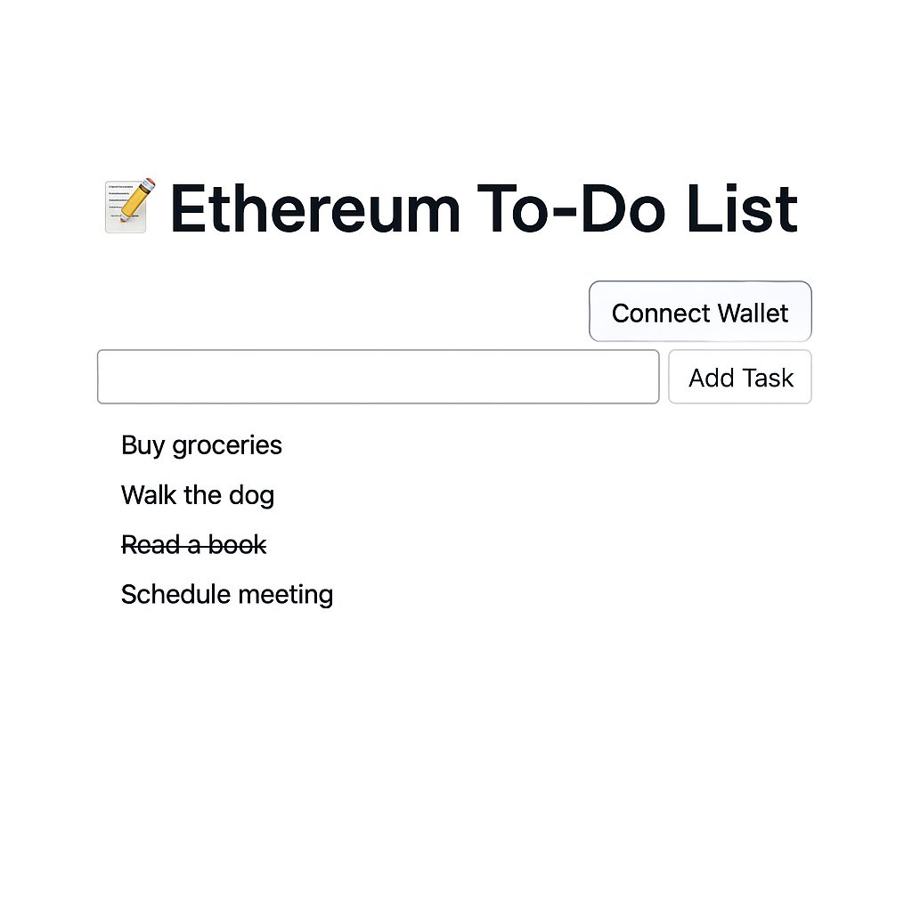

# Ethereum To-Do List dApp

This project is a simple **Ethereum-based To-Do List dApp** built using **React**, **RainbowKit**, **Wagmi**, **ethers.js**, and **Filecoin Calibration Network**. The app allows users to interact with a smart contract deployed on the Filecoin Calibration network to create and toggle tasks.

## Features

- **Connect Wallet**: Users can connect their wallet using RainbowKit.
- **Create Task**: Users can add new tasks to the list.
- **Toggle Task Completion**: Users can mark tasks as completed by clicking on them.
- **Smart Contract Integration**: The app interacts with a Solidity smart contract that stores tasks on the blockchain.

## Tech Stack

- **React**: Frontend framework.
- **RainbowKit**: For easy wallet integration and connecting to Web3.
- **Wagmi**: A React library for interacting with Ethereum (Filecoin in this case) and smart contracts.
- **ethers.js**: Library to interact with the Ethereum blockchain and smart contracts.
- **Solidity**: Smart contract language.
- **Filecoin Calibration Network**: Test network for Filecoin and Ethereum compatibility.

## Requirements

- **Node.js** (>=16.x)
- **npm** or **yarn**
- **A wallet like MetaMask** to interact with the dApp.

## Getting Started

### 1. Clone the repository

```bash
git clone https://github.com/your-username/todo-list-dapp.git
cd todo-list-dapp
```

### 2. Install dependencies

Install the required dependencies for the project:

```bash
npm install
# or
yarn install
```

### 3. Set up environment variables

Create a `.env` file in the root directory and add the contract address:

```env
VITE_CONTRACT_ADDRESS=0xYourContractAddressHere
```

### 4. Run the development server

Start the development server:

```bash
npm run dev
# or
yarn dev
```

This will start the app on `http://localhost:3000`.

### 5. Deploy Smart Contract (if not deployed)

1. **Deploy the smart contract** to the **Filecoin Calibration network** using tools like **Hardhat** or **Truffle**.
2. After deployment, update the contract address in the `.env` file.

### 6. Interacting with the app

- **Connect your wallet** using the RainbowKit "Connect Button".
- **Create tasks** by typing in the input box and clicking the "Add Task" button.
- **Mark tasks as completed** by clicking on the task name. The task will be marked with a strikethrough.

## File Structure

```
/src
  App.jsx                # Main React component
  main.jsx               # ReactDOM entry point
  wagmi.js               # Wagmi config for RainbowKit
  /contracts/utils/abi.json # ABI of the deployed TodoList contract
.env                     # Environment variables (contract address)
index.css                # Global styles
```

## Smart Contract

The smart contract deployed on the Filecoin Calibration Network is written in Solidity. It allows users to create and toggle tasks. The contract has the following methods:

- `createTask(string memory _content)`: Creates a new task with the provided content.
- `toggleCompleted(uint _id)`: Toggles the completion state of the task with the given ID.
- `getTask(uint _id)`: Retrieves the task's ID, content, and completion status.

### Example Smart Contract ABI

```json
[
  {
    "name": "TaskCreated",
    "type": "event",
    "inputs": [
      { "name": "id", "type": "uint256", "indexed": false },
      { "name": "content", "type": "string", "indexed": false },
      { "name": "completed", "type": "bool", "indexed": false }
    ],
    "anonymous": false
  },
  {
    "name": "createTask",
    "type": "function",
    "inputs": [{ "name": "_content", "type": "string" }],
    "outputs": [],
    "stateMutability": "nonpayable"
  },
  {
    "name": "taskCount",
    "type": "function",
    "inputs": [],
    "outputs": [{ "name": "", "type": "uint256" }],
    "stateMutability": "view"
  },
  {
    "name": "tasks",
    "type": "function",
    "inputs": [{ "name": "", "type": "uint256" }],
    "outputs": [
      { "name": "id", "type": "uint256" },
      { "name": "content", "type": "string" },
      { "name": "completed", "type": "bool" }
    ],
    "stateMutability": "view"
  }
]
```

## Contributing

1. Fork the repository.
2. Create a new branch (`git checkout -b feature-name`).
3. Make your changes.
4. Commit your changes (`git commit -am 'Add new feature'`).
5. Push to the branch (`git push origin feature-name`).
6. Create a new Pull Request.

## License

This project is licensed under the MIT License.

---

Feel free to adjust the sections based on any additional features or modifications you have in your project.

# FEVM Hardhat Kit

## Cloning the Repo

Open up your terminal (or command prompt) and navigate to a directory you would like to store this code on. Once there type in the following command:


```
git clone --recurse-submodules https://github.com/filecoin-project/fevm-hardhat-kit.git
cd fevm-hardhat-kit
yarn install
```


This will clone the hardhat kit onto your computer, switch directories into the newly installed kit, and install the dependencies the kit needs to work.


## Get a Private Key

You can get a private key from a wallet provider [such as Metamask](https://support.metamask.io/configure/accounts/how-to-export-an-accounts-private-key/).


## Add your Private Key as an Environment Variable

Add your private key as an environment variable by running this command:

 ```
export PRIVATE_KEY='abcdef'
```

If you use a .env file, don't commit and push any changes to .env files that may contain sensitive information, such as a private key! If this information reaches a public GitHub repository, someone can use it to check if you have any Mainnet funds in that wallet address, and steal them!


## Get the Deployer Address

Run this command:
```
yarn hardhat get-address
```

This will show you the ethereum-style address associated with that private key and the filecoin-style f4 address (also known as t4 address on testnets)! The Ethereum address can now be exclusively used for almost all FEVM tools, including the faucet.


## Fund the Deployer Address

Go to the [Calibrationnet testnet faucet](https://faucet.calibration.fildev.network/), and paste in the Ethereum address from the previous step. This will send some calibration testnet FIL to the account.


## Deploy the Contracts

Currently there are 3 main types of contracts:

* Basic Solidity Examples: Simple contracts to show off basic solidity

* Filecoin API Examples: Contracts that demo how to use the Filecoin APIs in Solidity to access storage deals and other Filecoin specific functions.

* Basic Deal Client: A contract that demos how to create Filecoin storage deals within Solidity smart contracts. See below to learn more.


Type in the following command in the terminal to deploy all contracts:

 ```
yarn hardhat deploy
```

This will compile all the contracts in the contracts folder and deploy them to the Calibrationnet test network automatically!

Keep note of the deployed contract addresses for the next step.

## Interact with the Contracts

You can interact with contracts via hardhat tasks, found in the 'tasks' folder. For example, to interact with the SimpleCoin contract:

Type in the following command in the terminal:

 ```
yarn hardhat get-balance --contract 'THE DEPLOYED CONTRACT ADDRESS HERE' --account 'YOUR ETHEREUM ADDRESS HERE'
```

The console should read that your account has 12000 SimpleCoin!

## Filecoin APIs

The primary advantage of the FEVM over other EVM based chains is the ability to access and program around Filecoin storage deals. This can be done in the FEVM via the [Filecoin.sol library maintained by Zondax](https://github.com/Zondax/filecoin-solidity). **Note this library is currently in BETA**. It is unaudited, and the APIs will likely be changing with time. This repo will be updated as soon as possible when a breaking change occurs.

The library is included in this kit as an NPM package and will automatically be downloaded when you perform the `yarn` command (don't confuse these with the included mocks)!

Currently you will find a getter contract that calls the getter methods on the MarketAPI to get storage deal data and store that data. To do this you will need *dealIDs* which you can [find here on FilFox](https://calibration.filfox.info/en/deal).

As an example to store most of the data available for a deal run the store-all command with a specified dealID. Below is an example of using this command below with a deal on Calibrationnet testnet with a dealID of 707.

```
yarn hardhat store-all --contract "DEPLOYED FILECOIN_MARKET_CONSUMER CONTRACT ADDRESS HERE" --dealid "707"
```

### Preparing Data for Storage

Before storing a file with a storage provider, it needs to be prepared by turning it into a .car file and the metadata must be recorded. To do this, the hardhat kit has a [tool submodule](https://github.com/filecoin-project/fevm-hardhat-kit/tree/main/tools), written in the language Go, which can do this for you. You can also use the [FVM Data Depot website](https://data.lighthouse.storage/) will automatically convert files to the .car format, output all the necessary metadata, and act as an HTTP retrieval point for the storage providers.

### Client Contract - Making Storage Deals in Solidity

Under contracts, within the `basic-deal-client` sub-directory, you will find a file called `DealClient.sol`. This is an example contract that uses the Filecoin.sol API's to create storage deals via Solidity smart contracts on Filecoin. This works by emitting a Solidity event that [Boost storage providers](https://boost.filecoin.io/) can listen to. To learn more about this contract feel free to [checkout the app kit repo](https://github.com/filecoin-project/fvm-starter-kit-deal-making) which includes a detailed readme and a frontend.

### Bounty Contract

Under contracts, within the `filecoin-api-examples` sub-directory, you will find a file called `deal-rewarder.sol`. This is a basic example contract that uses the Filecoin.sol API's to create bounties for specific data to be stored on the Filecoin blockchain. This is intended to be an example to illustrate how you can use the Filecoin APIs to do some cool functionality. To learn more about this contract feel free to [checkout the original Foundry project](https://github.com/lotus-web3/deal-bounty-contract) which includes a detailed readme.
